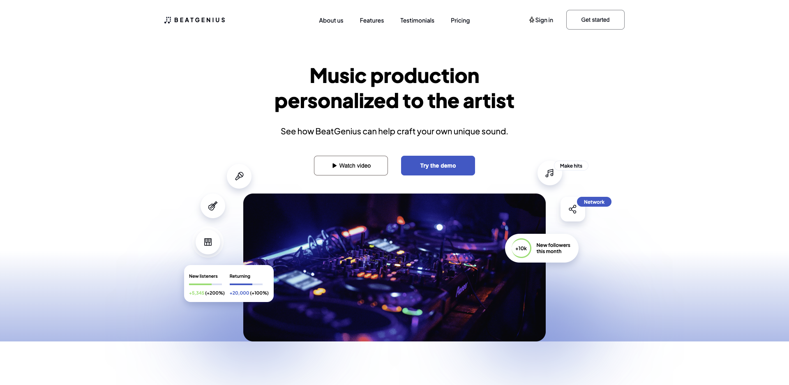

# BeatGenius

## Motivation

BeatGenius is a landing page for an imaginary collective of music producers selling customized music production services. I built this project specifically to practice my UI/UX skills.

### Technologies Used

- React.js
- Next.js
- CSS

---

## Installation

To install, clone the repository and run 'npm install'.

## License

